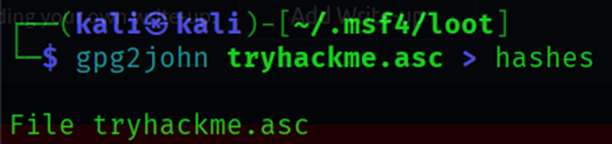

## Tomghost – TryHackMe Walkthrough

---

**Author:** Sanjay D<br>
**THM-Profile:** cyberdragon1 \[0x9]\[MAGE]

---

## 🔍 Enumeration

The first step in our assessment was to conduct an **Nmap** scan on the target machine to identify open ports and services. We ran the following command:

```bash
sudo nmap -sV -sS -A -sS -T4 10.10.51.74
```


The **Nmap** scan revealed several important details about the target:

* A **web server** (Apache Tomcat) was found running on port `8080/tcp`. This is unusual,because normally web servers run on port 80.
* Upon further investigation, we performed a **directory enumeration** search using **Gobuster** but did not find anything useful ,we just got the default Apache Tomcat directories.


Next, we examined the **Nmap** report again and noticed a service named **AJP13** running on port `8009/tcp`. This is associated with **Apache JServ Protocol v1.3**. This service caught our attention as it could have potential vulnerabilities.

### 🚨 Exploiting the Apache Tomcat AJP Service

Given the presence of Apache Tomcat's AJP service, we decided to investigate potential exploits. We used the **Metasploit Framework** to search for an exploit that could take advantage of this service.


After setting the necessary payload and RHOSTS (remote host) details. 


we executed the exploit.


To our surprise, we successfully retrieved what appeared to be **credentials**. We decided to test these credentials by attempting an SSH login.

```bash
ssh merlin@10.10.51.74
```


To our relief, the credentials worked, and we gained SSH access as the user **merlin**.

### 🔐 User Flag

After gaining SSH access, we proceeded to look for the **user.txt** flag. This flag was located in **merlin's** home directory, confirming our successful access to the user account.


---

### 🔼 Privilege Escalation

Our next objective was to escalate our privileges to **root**. We began by examining the capabilities of the user **skyfuck**, as we suspected there might be a potential avenue for privilege escalation.


Running `sudo -l` revealed that **skyfuck** did not have any sudo permissions, so we had to investigate other possibilities.

Upon inspecting the **skyfuck** user's files, we noticed two important files:


* One was an **encrypted PGP file**.
* The other contained **ASCII armor** data, which likely represented the key for decrypting the PGP file.


We attempted to import the ASCII armor into **GPG** but unfortunately could not decrypt the file. Since we weren’t able to decrypt it directly on the remote machine, we decided to download these files to our **Kali Linux** machine for further analysis.

### 🚀 Decrypting the PGP File Locally

To facilitate the decryption process, we set up a quick Python-based web server on our **Kali machine** to serve the files:

```bash
python3 -m http.server 8000
```


Then, we used **wget** to download the encrypted file to our local machine.


Next, we used **gpg2john** to convert the `.asc` file into a hash:

```bash
gpg2john tryhackme.asc > hashes
```



With the hash ready, we used **John the Ripper** to brute-force the passphrase:

```bash
john --format=gpg --wordlist=/home/kali/Downloads/rockyou.txt hashes
```

After some time, **John the Ripper** successfully cracked the passphrase. With the correct passphrase in hand, we returned to the target machine and decrypted the PGP file using **GPG**:


```bash
gpg --decrypt tryhackme.asc
```


The decrypted contents revealed the password for **merlin**, which we used to log in successfully.


### 🔓 Further Privilege Escalation via Misconfigured Permissions


Although we were logged in as **merlin**, we still lacked access to the **root** flag. We examined **merlin’s** available privileges and found an unusual entry: **merlin** could run the **/usr/bin/zip** command without requiring a password.


This was highly suspicious, as zip is typically not a command that should be run with elevated privileges.

### 🔍 GTFOBins: Exploiting the Zip Command

We immediately recalled a [GTFO-zip](https://gtfobins.github.io/gtfobins/zip/) entry for the `zip` command, which can be exploited for privilege escalation. **GTFOBins** is a curated list of Unix binaries that can be exploited to bypass security controls or escalate privileges on misconfigured systems.


To exploit this, we executed the following command to run `zip` with **sudo** privileges:

```bash
TF=$(mktemp -u)
sudo zip $TF /etc/hosts -T -TT 'sh #'
```


This spawned a shell and allowed us to escalate our privileges to **root**, as indicated by the `uid` shown in the output.

### 💥 Gaining a Root Shell

Now that we had root privileges, we spawned a fully interactive TTY shell using Python:

```bash
python3 -c 'import pty; pty.spawn("/bin/bash")'
```


We were now operating as **root**. At this point, we could access the **root.txt** flag, completing the privilege escalation process.


---

### 🏁 Flags Captured

* **user.txt** ✅
* **root.txt** ✅

---

### ✅ Summary

* **Initial Access**: Gained SSH access using credentials obtained from an Apache Tomcat AJP service exploit.
* **Privilege Escalation**: Decrypted a PGP file to obtain **merlin’s** password, then escalated privileges by exploiting a misconfigured **zip** binary.
* **Root Access**: Spawned a TTY shell to gain root access and captured the **root.txt** flag.

* Pwned the Tomghost !!!
  


---
