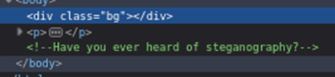
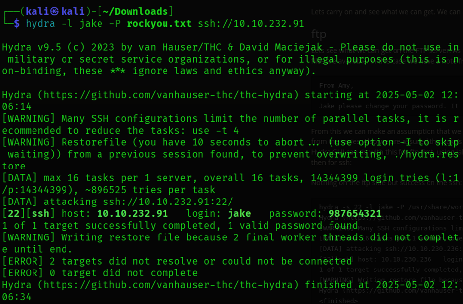

## 🕵️ Brooklyn Nine-Nine – TryHackMe Walkthrough

---
**Author:** Sanjay  
**Date:** May 3, 2025  
**Profile:** cyberdragon1 [0x9][MAGE]   

---


### 🔍 Enumeration

We begin the assessment by scanning the target machine using Nmap to identify open ports and services:

```bash
sudo nmap -sS -sV -A -T4 10.10.232.91
```

From the Nmap Scan report we can see that :
1.There is a ftp service running on port number 21 version-vsftpd 3.0.3 
2.ssh service on port 22 openSSH 7.6p1
3.http server on port 80 hosted using Apache/2.4.29

we performed directory enumeration using Gobuster to check for hidden directories:

```bash
gobuster dir -u http://10.10.232.91 -w /usr/share/wordlists/seclists/Discovery/Web-Content/directory-list-2.3-medium.txt
```


However, this yielded no useful results.

As we can see there is a possible Anonymous FTP login from the nmap report, we attempted the anonymous login on the FTP server and were successfully authenticated. Upon browsing the available files, we found a text file which we downloaded to our local machine.


Viewing the contents of the file using `cat` revealed a name: **Jake**, which could potentially be a valid username.


### 🧠 Intelligence Gathering

Inspecting the website's source code revealed a comment referencing an image. 



We downloaded the image and suspected it might contain hidden information, possibly using steganography.

To investigate further, we used **stegcracker** with the popular `rockyou.txt` wordlist:

```bash
stegcracker image.jpg /usr/share/wordlists/rockyou.txt
```

After successful cracking, the tool extracted a hidden message and saved it in an output file. The message provided valuable information, which we noted for later use.


The extracted data revealed credentials for the user holt.


### 🔓 Brute-Force Attack

With Jake identified as a potential username, we proceeded to brute-force his SSH credentials using Hydra:

```bash
hydra -l Jake -P /usr/share/wordlists/rockyou.txt ssh://10.10.232.91
```


Hydra successfully identified valid SSH credentials for the user **Jake**.

### 📁 User Access and Privilege Escalation

After logging in via SSH as Jake, we discovered a second user named **holt**. Within holt's home directory, we found the `user.txt` flag.


To escalate privileges, we checked what commands user **holt** was allowed to execute as root using `sudo -l`. It was revealed that holt could run `/usr/bin/less` with root privileges and without a password.


We exploited this by running the following command:

```bash
sudo /usr/bin/less /root/root.txt
```


This gave us access to the `root.txt` flag.


---

## 🏁 Flags Captured

* `user.txt` ✅
* `root.txt` ✅

---

## ✅ Summary

* Gained initial access via anonymous FTP login.
* Discovered potential credentials through steganography.
* Used Hydra to brute-force SSH login for Jake.
* Found user and root flags using privilege escalation via misconfigured `less` binary.
* Pwned Brooklyn nine nine !!!!!


---

